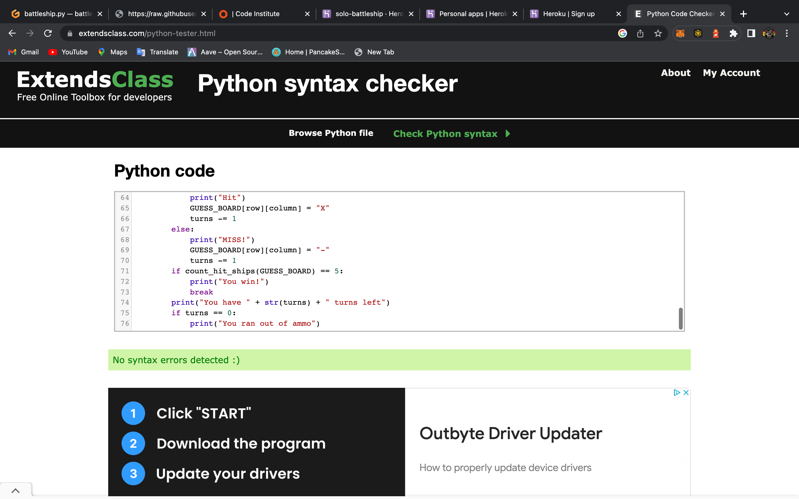

# Battleship Game(single player)
This is a solo player battleship game. The objective is to sink all 5 ships with only 10 tries.

## How to play! 

- When the game has been run you will be prompted to select a row and column between 1-8 and A-H

- If you hit a ship it will return with X on that location to show thats a hit

- If you miss a shot it will return -

- You have 10 turns to try and hit all 5 ships 

- Goodluck!

### in-game controls

Start Game

End Game

Shot Missed

Shot Hit

Error in valid location

Error location already hit

### Features Left to Implement

- A feature that i would like to have implemented would be a highscore system, where you would enter your name and it will store the highest amount of ships hit within the 10 turns

### Validator Testing 

Python validation

## Deployment

## Credits 

- https://www.w3schools.com/
- https://www.youtube.com/watch?v=ZYV6dYtz4HA

